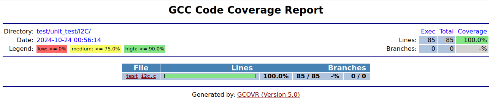
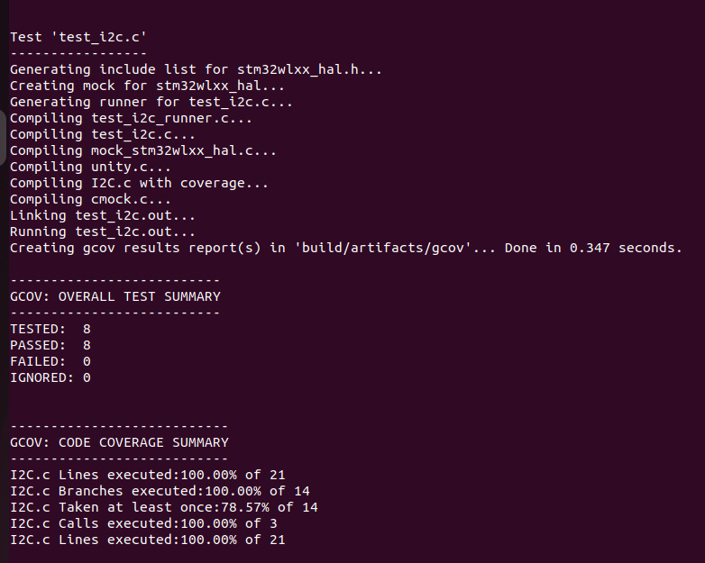

# Testing de Software en Sistemas Embebidos - CESE UBA
## Trabajo Práctico 3

>Autor: Edilberto Carvajal

Testing automático del periferico I2C con Unity y ceedling

### Tests

Tests desarrollados:

```
1- transmisión y recepción exitosa en user_i2c_read.
2- error en la transmisión en user_i2c_read.
3- transmisión exitosa seguida de fallo en recepción en user_i2c_read.
4- operación de escritura exitosa en user_i2c_write.
5- error en la transmisión en user_i2c_write.
6- operación de escritura con longitud cero en user_i2c_write.
7- puntero de interfaz nulo en user_i2c_read.
8- puntero de interfaz nulo en user_i2c_write.
```
### Reporte de cobertura



